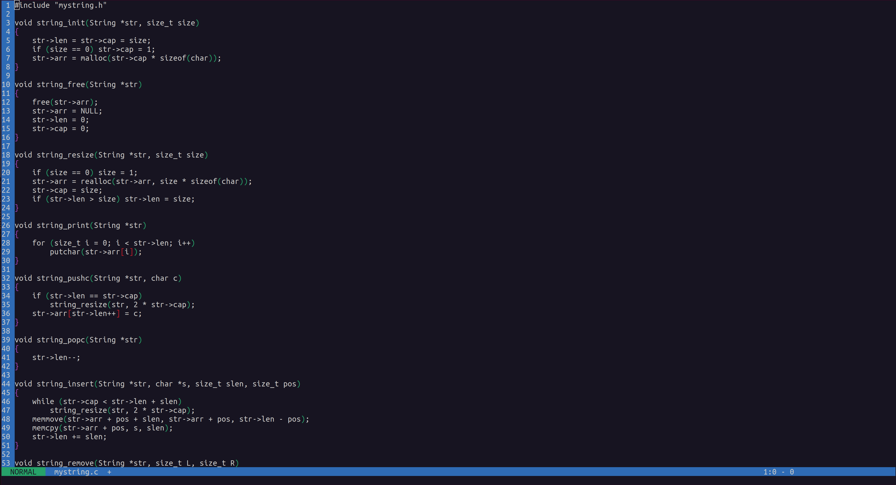

# vim
A teminal text editor written in C similar to vim.

## Features
- Auto-indenting C code
- Undo
- Find & replace
- Highlighting brackets
- Visual text selection & copy/cut/paste
- Editting large files
- Comparing files (similar to diff)
- Directory tree listing

## Usage Guide
- 3 modes: `NORMAL`, `INSERT`, and `VISUAL`
- Press `i` to switch to `INSERT` from `NORMAL`, and `esc` to switch back.
- Press `v` to switch to `VISUAL` from `NORMAL`, and `esc` to switch back.
- Press `d` in `VISUAL` mode to cut selected text.
- Press `y` in `VISUAL` mode to copy selected text.
- Press `p` in `NORMAL` mode to paste.
- Press `u` in `NORMAL` mode to undo.
- Press `=` in `NORMAL` mode to auto-indent C code.
- Press `/` in `NORMAL` mode and enter phrase to search for.
- Press `n` to go to the next search match or any other key to quit search mode.
- Press `:` in `NORMAL` mode to enter commands.

## Commands
**NOTE:** This editor is designed to edit files inside a workspace directory named `root` in the current working directory, with a path similar to absolute paths but starting from `root`. For example, if you want to open a file with the relative path `root/mydir/sample.txt`, you must use the path `/root/mydir/sample.txt` as argument to the commands below.

**NOTE:** Use double quotes with any argument that has spaces in it. (See examples)

- `:exit` to exit
- `:open <path>` to open a file
- `:save` to save the current file
- `:saveas <path>` to save as a different name
- `:create --file <path>` to create an empty file
- `:cat --file <path>` to copy the content of the file into the editor buffer in an untitled file
- `:compare <path1> <path2>` to compare two files (similar to diff)
- `:undo` to undo (same us pressing `u`)
- `:auto-indent` to auto-indent (same as pressing `=`)
- `:tree <depth>` to show a directory tree listing of the workspace (`root`) folder with custom depth (use `:tree -1` for unlimited depth)
- `:replace --old <old> --new <new> [-all | -at <occurrence#>]` to replace all or a specific occurrence of something

### Examples
- `:open /root/myproject/sample.c`
- `:replace --old "this is a sentence" --new "hello world" -all`
- `cat --file "/root/some dir with spaces/test.txt"`
